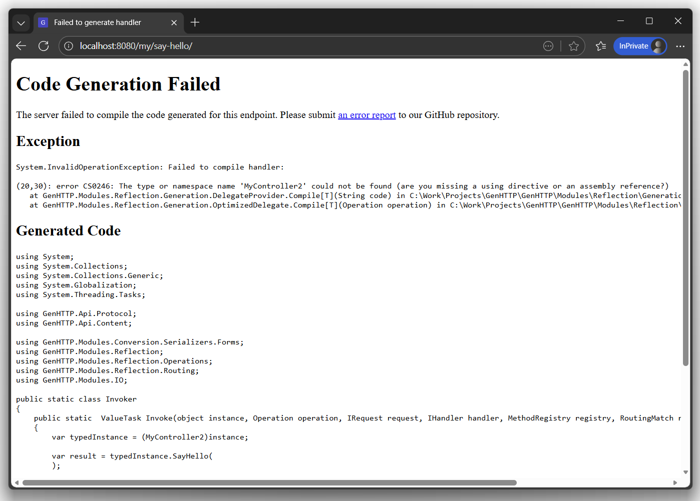

By default, the server will use the reflection APIs to analyze and execute
webservice methods. For improved performance, there is an experimental
code generation mode that compiles a delegate that fetches the input arguments
from the request, execute the webservice method and map the result into
a HTTP response.


  This feature will be enabled by default with GenHTTP 11.



  Code generation is not supported on ARM-based CPUs due to limitations of the .NET framework on this platform.
  As code generation is performed at runtime, this mode is not available for AoT apps. 
  The service framework will automatically fall back to reflection in
  affected environments.



  Compilation is currently performed during first execution of an endpoint, which can cause
  a delay for the first request. In GenHTTP 11, compilation will be done on startup.


## Enabling Code Generation

Code generation can be enabled by passing `ExecutionMode.Auto` to the framework handlers
(in contrast to `ExecutionMode.Reflection`, which is the default value).




  ```csharp
  using GenHTTP.Engine.Internal;
  
  using GenHTTP.Modules.Layouting;
  using GenHTTP.Modules.Practices;
  using GenHTTP.Modules.Reflection;
  using GenHTTP.Modules.Webservices;
  
  // http://localhost:8080/my/
  
  var api = Layout.Create()
                  .AddService<MyService>("my", mode: ExecutionMode.Auto);
  
  await Host.Create()
            .Handler(api)
            .Defaults()
            .Console()
            .RunAsync();
  
  public class MyService
  {
  
      [ResourceMethod]
      public string SayHello() => "Hello World!";
  
  }
  ```



  ```csharp
  using GenHTTP.Engine.Internal;

  using GenHTTP.Modules.Functional;
  using GenHTTP.Modules.Practices;
  using GenHTTP.Modules.Reflection;
  
  // http://localhost:8080/
  
  var api = Inline.Create()
                  .Get(() => "Hello World!")
                  .ExecutionMode(ExecutionMode.Auto);
  
  await Host.Create()
            .Handler(api)
            .Defaults()
            .Console()
            .RunAsync();
  ```



  ```csharp
  using GenHTTP.Engine.Internal;
  
  using GenHTTP.Modules.Controllers;
  using GenHTTP.Modules.Layouting;
  using GenHTTP.Modules.Practices;
  using GenHTTP.Modules.Reflection;
  
  // http://localhost:8080/my/say-hello/
  
  var api = Layout.Create()
                  .AddController<MyController>("my", mode: ExecutionMode.Auto);
  
  await Host.Create()
            .Handler(api)
            .Defaults()
            .Console()
            .RunAsync();
  
  public class MyController
  {
  
      public string SayHello() => "Hello World!";
  
  }
  ```




## Benchmarks

The code generated for a service method is highly optimized to directly read values from the request,
similar as you would do it in a handwritten `IHandler` instance. Nevertheless, the routing required
to find and invoke the requested service method adds a small overhead. The following table shows the
performance of the different modes. As there were a lot of improvements when the code generation
feature has been added to the reflection module, there is also a comparison to version 10.3 without
those optimizations.

| Mode              | Requests / s | Result |
|-------------------|--------------|--------|
| Native Handler    | 123,031      | 100%   |
| Code Generation   | 121,465      | 98.7%  |
| Reflection        | 118,230      | 96.1%  |
| Reflection (10.3) | 115,157      | 93.6%  |

## Error Handling

If the server fails to compile a delegate for a given method signature, an error page
will be rendered when the corresponding endpoint is called. If you encounter such an issue,
please [report a bug](https://github.com/Kaliumhexacyanoferrat/GenHTTP/issues/new?template=code-generation-issue.md) to 
our GitHub repository.

