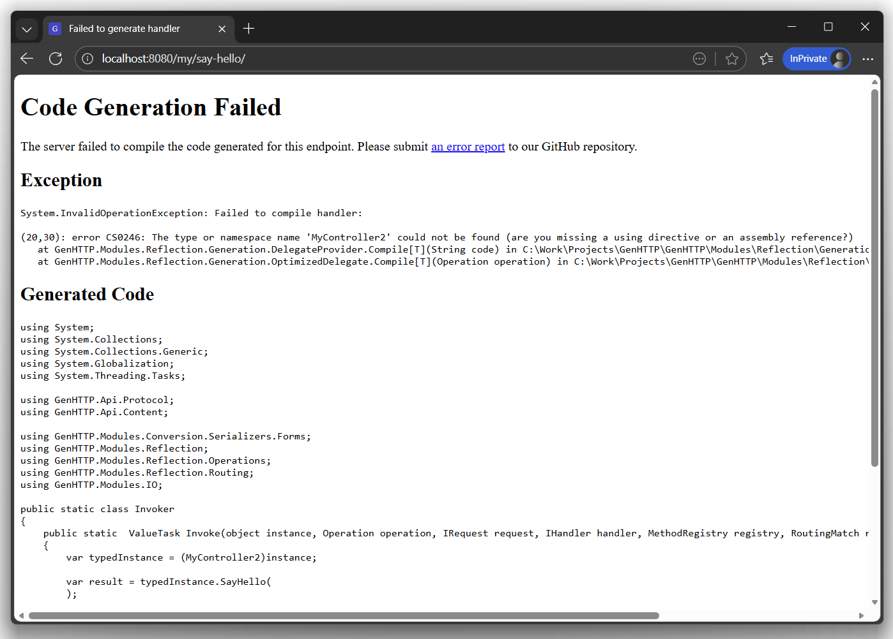

---
title: Code Generation
description: Enables code generation for GenHTTP web services for faster execution.
weight: 3
cascade:
  type: docs
---

To run web service methods, the server will either use code generation or reflection,
based on the configuration and the execution environment. If supported, web service handlers
will by default generate an optimized implementation snippet and compile it during preparation. As
a fallback, reflection will be used to dynamically run the web server methods.


  Code generation is not supported on ARM-based CPUs due to limitations of the .NET framework on this platform.
  As code generation is performed at runtime, this mode is not available for AoT apps. 
  The service framework will automatically fall back to reflection in
  affected environments.


## Disabling Code Generation

Code generation can be disabled by passing `ExecutionMode.Reflection` to the framework handlers
(in contrast to `ExecutionMode.Auto`, which is the default value).




  ```csharp
  using GenHTTP.Engine.Internal;
  
  using GenHTTP.Modules.Layouting;
  using GenHTTP.Modules.Practices;
  using GenHTTP.Modules.Reflection;
  using GenHTTP.Modules.Webservices;
  
  // http://localhost:8080/my/
  
  var api = Layout.Create()
                  .AddService<MyService>("my", mode: ExecutionMode.Reflection);
  
  await Host.Create()
            .Handler(api)
            .Defaults()
            .Console()
            .RunAsync();
  
  public class MyService
  {
  
      [ResourceMethod]
      public string SayHello() => "Hello World!";
  
  }
  ```



  ```csharp
  using GenHTTP.Engine.Internal;

  using GenHTTP.Modules.Functional;
  using GenHTTP.Modules.Practices;
  using GenHTTP.Modules.Reflection;
  
  // http://localhost:8080/
  
  var api = Inline.Create()
                  .Get(() => "Hello World!")
                  .ExecutionMode(ExecutionMode.Reflection);
  
  await Host.Create()
            .Handler(api)
            .Defaults()
            .Console()
            .RunAsync();
  ```



  ```csharp
  using GenHTTP.Engine.Internal;
  
  using GenHTTP.Modules.Controllers;
  using GenHTTP.Modules.Layouting;
  using GenHTTP.Modules.Practices;
  using GenHTTP.Modules.Reflection;
  
  // http://localhost:8080/my/say-hello/
  
  var api = Layout.Create()
                  .AddController<MyController>("my", mode: ExecutionMode.Reflection);
  
  await Host.Create()
            .Handler(api)
            .Defaults()
            .Console()
            .RunAsync();
  
  public class MyController
  {
  
      public string SayHello() => "Hello World!";
  
  }
  ```




## Benchmarks

The code generated for a service method is highly optimized to directly read values from the request,
similar as you would do it in a handwritten `IHandler` instance. Nevertheless, the routing required
to find and invoke the requested service method adds a small overhead. The following table shows the
performance of the different modes.

| Mode              | Requests / s | Result |
|-------------------|--------------|--------|
| Native Handler    | 123,031      | 100%   |
| Code Generation   | 121,465      | 98.7%  |
| Reflection        | 118,230      | 96.1%  |

## Error Handling

If the server fails to compile a delegate for a given method signature, an error page
will be rendered when the corresponding endpoint is called. If you encounter such an issue,
please [report a bug](https://github.com/Kaliumhexacyanoferrat/GenHTTP/issues/new?template=code-generation-issue.md) to 
our GitHub repository.


