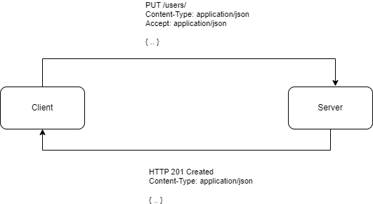

All API frameworks share a common base provided by the `Reflection` and `Conversion` modules which
define some of the capabilities that can be used when defining an API method
signature.

## Injection

This section describes how parameters of your methods are initialized and which
kind of types can be used.

### Primitives

By default, the following types can be used as parameters within a method definition: 
`string`, `bool`, `enum`, `Guid`, `DateOnly` and any other primitive type (such as
`int`).




  ```csharp
  [ResourceMethod]
  public int Length(string text) => text.Length;
  ```



  ```csharp
  .Get((string text) => text.Length)
  ```



  ```csharp
  public int Index(string text) => text.Length;
  ```




Parameters can be declared nullable (e.g. `int?`) and will be initialized with `null` if not present.
If not declared nullable, parameters will be initialized with `default(T)` if not present.

By default, parameters are read from the request query (`?text=abc`) or from a [form encoded](#html-forms) body.

If you would like to read the parameter directly from the request body, you can mark it with the `[FromBody]` attribute.




  ```csharp
  [ResourceMethod(RequestMethod.PUT)]
  public int Length([FromBody] string text) => text.Length;
  ```



  ```csharp
  .Put(([FromBody] string text) => text.Length)
  ```



  ```csharp
  [ControllerAction(RequestMethod.PUT)]
  public int Index([FromBody] string text) => text.Length;
  ```




To read the parameter from the request path, use the appropriate method provided by the application framework.




  ```csharp
  [ResourceMethod(RequestMethod.DELETE, ":id")]
  public void Delete(int id) { /* ... */ }
  ```



  ```csharp
  .Delete("/:id", (int id) => { /* ... */ })
  ```



  ```csharp
  [ControllerAction(RequestMethod.DELETE)]
  public int Delete([FromPath] int id) { /* ... */ }
  ```




Some frameworks allow to further restrict path parameters using a regular expression.




  ```csharp
  [ResourceMethod("(?<ean13>[0-9]{12,13})")]
  public Book? GetBook(int ean13) { /* ... */ }
  ```



  ```csharp
  .Get("/books/?<ean13>[0-9]{12,13})", (int ean13) => { /* ... */ })
  ```




### Complex Types

When using a complex type in a parameter declaration, the value will be [deserialized](#serialization-formats) from the
request body. By default, handlers will accept content declared as XML, JSON, YAML or form encoded. If
the client does not declare the `Content-Type`, the server will try to treat the body as JSON.




  ```csharp
  [ResourceMethod(RequestMethod.POST)]
  public void Save(MyClass data) { /* ... */ }
  ```



  ```csharp
  .Post((MyClass data) => { /* ... */ })
  ```



  ```csharp
  [ControllerAction(RequestMethod.POST)]
  public void Save(MyClass data) { /* ... */ }
  ```




### HTML Forms

Form data can be used to populate both complex types and primitive parameters. Browsers
will encode the content as `application/x-www-form-urlencoded` and the framework will
populate the arguments as needed. This allows such endpoints to be used both from
browsers and as a regular API.

Example form:

```html
    <form action="/save" method="post">
        <label for="id">ID:</label>
        <input type="number" id="id" name="id" required>
        <br><br>
        
        <label for="name">Name:</label>
        <input type="text" id="name" name="name" required>
        <br><br>
        
        <input type="submit" value="Submit">
    </form>
```

Can be read using the following definitions:




  ```csharp
  [ResourceMethod(RequestMethod.POST)]
  public void Save(int id, string name) { /* ... */ }
  
  // or
  
  [ResourceMethod(RequestMethod.POST)]
  public void Save(MyRecord record) { /* ... */ }  
  ```



  ```csharp
  .Post("/save", (int id, string name) => { /* ... */ })
  
  // or
  
  .Post("/save", (MyRecord data) => { /* ... */ })
  ```



  ```csharp
  [ControllerAction(RequestMethod.POST)]
  public void Save(int id, string name) { /* ... */ }
  
  // or
  
  [ControllerAction(RequestMethod.POST)]
  public void Save(MyRecord data) { /* ... */ }
  ```




Both mechanisms can also be mixed (read one argument as a parameter and all
others as a custom type).

### Request Injection

To access information about the currently executed request you can add a parameter of
type `IRequest` to your method definition which will automatically be populated.




  ```csharp
  [ResourceMethod]
  public string? GetUserAgent(IRequest request) => request.UserAgent;
  ```



  ```csharp
  .Get("/user-agent", (IRequest request) => request.UserAgent)
  ```



  ```csharp
  public string? UserAgent(IRequest request) => request.UserAgent;
  ```




Injecting requests is required if you would like to generate [custom responses](#custom-responses).

If you frequently access the request in your endpoints to achieve a certain functionality,
think about adding [custom primitives](#custom-primitives), [custom injectors](#custom-injection)
or a [custom concern](../../concerns/).

### Handler Injection

Similar to request injection you can also inject the `IHandler` which is responsible for the
current request. This is typically not required but can be used to create and return 
[custom requests handlers](#handlers) on the fly.

### Streams

The request body can be injected as a `Stream`, e.g. when implementing
file uploads. This stream represents the processed request payload, so it
will already be decompressed and not in a chunked format. Depending on the
size of request body this will either be a stream backed by memory or by a file
and is therefore well suited for very large payloads.




  ```csharp
  [ResourceMethod(RequestMethod.PUT, "upload")]
  public void Upload(Stream file) { /* ... */ }
  ```



  ```csharp
  .Put("/upload", (Stream file) => { /* ... */ })
  ```



  ```csharp
  [ControllerAction(RequestMethod.PUT)]
  public void Upload(Stream file) { /* ... */ }
  ```




### Custom Injection

To inject custom types besides the built-in capabilities, you can configure
a custom `InjectionRegistry` and use it with your API services. The registry accepts 
`IParameterInjector` instances that define what types are supported and how 
they are determined from the current request and environment.

The following injector will inspect the requests headers for a correlation ID
and create a new one if not present.

```csharp
public record class CorrelationID(string ID);

public class CorrelationInjector : IParameterInjector
{

    public bool Supports(Type type) => type == typeof(CorrelationID);

    public object? GetValue(IHandler handler, IRequest request, Type targetType)
    {
        if (request.Headers.TryGetValue("X-Correlation-ID", out var id))
        {
            return new CorrelationID(id);
        }

        return new CorrelationID(Guid.NewGuid().ToString());
    }

}
```

The injector can than be added to the default injection registry:




  ```csharp
  var injection = Injection.Default()
                           .Add(new CorrelationInjector());

  var api = Layout.Create()
                  .AddService<MyService>("service", injection);

  public class MyService
  {

      [ResourceMethod]
      public string GetCorrelationID(CorrelationID cor) => cor.ID;

  }
  ```



  ```csharp
  var injection = Injection.Default()
                           .Add(new CorrelationInjector());

  var api = Inline.Create()
                  .Injectors(injection)
                  .Get((CorrelationID cor) => cor.ID);
  ```



  ```csharp
  var injection = Injection.Default()
                         .Add(new CorrelationInjector());

  var api = Layout.Create()
                  .AddController<MyController>("controller", injection);

  public class MyController
  {

      public string GetCorrelationID(CorrelationID cor) => cor.ID;

  }
  ```




### User Injection

To inject the [authenticated user](../../concerns/authentication/), you can
add a typed injector to your [injection registry](#custom-injection).

```csharp
var injection = Injection.Default()
                         .Add(new UserInjector<BasicAuthenticationUser>());
```

Instead of injecting the user, you can also use a built-in [interceptor](#interceptors)
to achieve [role-based authorization](../../concerns/authentication/#role-based-authorization).

## Response Generation

This section describes the various mechanisms to generate a service response.

### Primitives

By default, the following types can be used as a return type within a method definition:
`string`, `bool`, `enum`, `Guid`, `DateOnly` and any other primitive type (such as
`int`).

If declared nullable, the server will generate a `HTTP 204 No Content` if `null` is returned.




  ```csharp
  [ResourceMethod]
  public int Length(string text) => text.Length;
  ```



  ```csharp
  .Get((string text) => text.Length)
  ```



  ```csharp
  public int Index(string text) => text.Length;
  ```




### Complex Types

When returning a complex type, the value will be [serialized](#serialization-formats) and sent
to the client. The response format is negated with the client using the `Accept` request
header. By default, the server is capable of generating XML, JSON, YAML or form encoded responses. If
no format is specified by the client, the implementation will fall back to JSON.

If declared nullable, the server will generate a `HTTP 204 No Content` if `null` is returned.




  ```csharp
  [ResourceMethod]
  public MyType DoWork() => new();
  ```



  ```csharp
  .Get(() => new MyType())
  ```



  ```csharp
  public MyType Index() => new();
  ```




### Custom Responses

When injecting the request into your method, you can directly generate an `IResponse`
or `IResponseBuilder` and return it to the client. This allows you to take full control
over the response generation but is less readable than the typed versions.





  ```csharp
  [ResourceMethod]
  public IResponseBuilder Respond(IRequest request)
  {
     var content = Resource.FromString("Hello World")
                           .Build();
     
     return request.Respond()
                   .Header("X-My-Header", "my-value")
                   .Content(content)
                   .Type(ContentType.TextPlain);
  }
  ```



  ```csharp
  .Get((IRequest request) => {
     var content = Resource.FromString("Hello World")
                           .Build();
     
     return request.Respond()
                   .Header("X-My-Header", "my-value")
                   .Content(content)
                   .Type(ContentType.TextPlain);
  })
  ```



  ```csharp
  public IResponseBuilder Respond(IRequest request)
  {
     var content = Resource.FromString("Hello World")
                           .Build();
     
     return request.Respond()
                   .Header("X-My-Header", "my-value")
                   .Content(content)
                   .Type(ContentType.TextPlain);
  }
  ```




// ToDo: Doku zu möglichen Contents (verlinken bei custom handler?)

### Results

Results are type-safe responses that can still be adjusted to modify the
generated HTTP response. Therefore, results can be considered an advanced
way to generate responses without the need to fully generate the response
in the first place.




  ```csharp
  [ResourceMethod]
  public Result<string> DoWork() 
  {
    return new Result<string>("Hello World").Header("X-My-Header", "my-value");
  }
  ```



  ```csharp
  .Get(() => new Result<string>("Hello World").Header("X-My-Header", "my-value"))
  ```



  ```csharp
  public Result<string> Index()
  {
    return new Result<string>("Hello World").Header("X-My-Header", "my-value");
  }
  ```




The `Result<T>` class allows to adjust any response property besides the actual content
by implementing the same interfaces as the `IResponseBuilder`.  This does not only work
for data structures, but also for special types such as streams.

### Handlers

Instead of generating a response you can also return an `IHandler` or `IHandlerBuilder` instance.
This allows you to provide a whole segment on your web application by re-using the
[existing handlers](../../handlers/) or by implementing [custom ones](../../handlers/).

The following example will render a fully navigable directory listing view depending on
the tenant ID passed to the method:




  ```csharp
  [ResourceMethod("files/:tenant")]
  public IHandlerBuilder Files(int tenant) 
  {
    var tree = ResourceTree.FromDirectory($"/data/tenants/{tenant}");

    return Listing.From(tree);
  }
  ```



  ```csharp
  .Get("/files/:tenant", (int tenant) => Listing.From(ResourceTree.FromDirectory($"/data/tenants/{tenant}")))
  ```



  ```csharp
  public IHandlerBuilder Files(int tenant) 
  {
    var tree = ResourceTree.FromDirectory($"/data/tenants/{tenant}");

    return Listing.From(tree);
  }
  ```




### Streams

To return files or similar content, you can directly return a `Stream` instance
from your method.
The framework will automatically seek and dispose the stream. Returning streams
is not thread-safe as streams are stateful, so you will need to create a new 
instance for every request to be answered.




  ```csharp
  [ResourceMethod]
  public Stream GetFile() => File.OpenRead("...");
  ```



  ```csharp
  .Get(() => File.OpenRead("..."))
  ```



  ```csharp
  public Stream File() => File.OpenRead("...");
  ```




### Empty Responses

Methods with a `void` return type will automatically generate a `HTTP 204 No Content`
response. This is also the case when `null` is returned.




  ```csharp
  [ResourceMethod]
  public void DoWork() { }
  ```



  ```csharp
  .Get(() => { }})
  ```



  ```csharp
  public void DoWork() { }
  ```




### Asynchronous Execution

Service methods returning a `Task` or `ValueTask` will be executed
asynchronously. All the features described in this document will work
for asynchronous execution as well. 




  ```csharp
  [ResourceMethod]
  public async ValueTask<int> DoWork() { /* ... */ }
  ```



  ```csharp
  .Get(async () => await ...)
  ```



  ```csharp
  public async ValueTask<int> DoWork() { /* ... */ }
  ```




## Registries

This section describes registries that can be used for both injection as well as
response generation.

### Custom Primitives

Primitives (such as `Guid` or `int`) used in parameters or as a response type are automatically
handled using the built-in `FormatterRegistry`. You can add support for a custom type by
implementing an `IFormatter` and adding it to a custom registry which is then used by your
services.

The following implementation will add support for a `Point` type with `x` and `y` coordinates
so it can be used in a service.

```csharp
public record class Point(int X, int Y);

public class PointFormatter : IFormatter
{

    public bool CanHandle(Type type) => type == typeof(Point);

    public object? Read(string value, Type type)
    {
        var parts = value.Split('-');

        return new Point(int.Parse(parts[0]), int.Parse(parts[1]));
    }

    public string? Write(object value, Type type)
    {
        var point = (Point)value;

        return $"{point.X}-{point.Y}";
    }

}
```

This formatter can then be added to the default formatting registry.




  ```csharp
  var registry = Formatting.Default()
                           .Add(new PointFormatter());

  var api = Layout.Create()
                  .AddService<MyService>("service", registry);

  public class MyService
  {

      [ResourceMethod("invert/:point")]
      public Point Invert(Point point) => new(point.Y, point.X);

  }
  ```



  ```csharp
  var registry = Formatting.Default()
                           .Add(new PointFormatter());

  var api = Inline.Create()
                  .Formatters(registry)
                  .Get("/invert/:point", (Point point) => new(point.Y, point.X));
  ```



  ```csharp
  var registry = Formatting.Default()
                         .Add(new PointFormatter());

  var api = Layout.Create()
                  .AddController<MyController>("controller", registry);

  public class MyController
  {

      public Point Invert([FromPath] Point point) => new(point.Y, point.X);

  }
  ```




The serialization format is implemented by our formatter, so the API can be called
via `/invert/8-10` and will return `10-8` as a text formatted response.

### Serialization Formats

Serialization allows to read and write complex types, so they can be used in
your method definitions. By default, services can consume and produce entities
in XML, JSON, YAML or in form encoding, with a default fallback to JSON. 

When sending an entity to your service, the client should specify the `Content-Type`
of the body so the server can choose the correct deserializer to read the data with. The `Accept`
header sent by the client tells the server which serialization format is preferred by
the client when a response is generated. The server will tell the client which
serialization format was used to generate the body of the response by specifying the
`Content-Type` header again.



To add support for an additional format you can implement the `ISerializationFormat` and
add your implementation to a registry which is then passed to your service. 

For example, the nuget package `GenHTTP.Modules.Protobuf` adds support for
[Protocol Buffers](https://protobuf.dev/) which is not enabled by default. The 
following snippet shows how to register the protobuf format and use it in 
a service.




  ```csharp
  var registry = Serialization.Default()
                              .Add(new FlexibleContentType("application/protobuf"), new ProtobufFormat());

  var api = Layout.Create()
                  .AddService<MyService>("service", registry);

  public class MyService
  {

      [ResourceMethod(RequestMethod.PUT)]
      public ResponseType Store(RequestType data) { /* ... */ }

  }
  ```



  ```csharp
  var registry = Serialization.Default()
                              .Add(new FlexibleContentType("application/protobuf"), new ProtobufFormat());

  var api = Inline.Create()
                  .Serializers(registry)
                  .Put((RequestType data) => { /* ... */ });
  ```



  ```csharp
  var registry = Serialization.Default()
                              .Add(new FlexibleContentType("application/protobuf"), new ProtobufFormat());

  var api = Layout.Create()
                  .AddController<MyController>("controller", registry);

  public class MyController
  {

      [ControllerAction(RequestMethod.PUT)]
      public ResponseType Store(RequestType data) { /* ... */ }

  }
  ```




To configure the default serialization formats, you can pass configuration options directly to the 
`Default()` factory:

```csharp
var options = new JsonSerializerOptions()
{
    WriteIndented = false
};

var serialization = Serialization.Default(jsonOptions: options);
```

## Interceptors

With interceptors, you can add behavior on operation-level by using additional attributes. This is useful
for features such as authorization.




  ```csharp
  using System.Net;
  
  using GenHTTP.Api.Content;
  using GenHTTP.Api.Protocol;
  
  using GenHTTP.Engine.Internal;
  
  using GenHTTP.Modules.Layouting;
  using GenHTTP.Modules.Reflection;
  using GenHTTP.Modules.Reflection.Operations;
  using GenHTTP.Modules.Webservices;
  
  var app = Layout.Create().AddService<MyService>("service");
  
  await Host.Create()
            .Handler(app)
            .RunAsync();
  
  class RequireLocalhostAttribute : InterceptWithAttribute<LocalhostInterceptor>;
  
  class LocalhostInterceptor : IOperationInterceptor
  {
  
      public void Configure(object attribute)
      {
          if (attribute is RequireLocalhostAttribute)
          {
              // ...
          }
      }
  
      public ValueTask<InterceptionResult?> InterceptAsync(IRequest request, Operation operation, IReadOnlyDictionary<string, object?> arguments)
      {
          if (!request.Client.IPAddress.Equals(IPAddress.Loopback))
          {
              throw new ProviderException(ResponseStatus.Forbidden, "Access from localhost only!");
          }
  
          return default;
      }
  
  }
  
  class MyService
  {
  
      [ResourceMethod]
      [RequireLocalhost]
      public string MyMethod() => "Hello to localhost";
  
  }
  ```



  ```csharp
  using System.Net;
  
  using GenHTTP.Api.Content;
  using GenHTTP.Api.Protocol;
  
  using GenHTTP.Engine.Internal;
  
  using GenHTTP.Modules.Functional;
  using GenHTTP.Modules.Reflection;
  using GenHTTP.Modules.Reflection.Operations;
  
  var app = Inline.Create().Get([RequireLocalhost]() => "Hello to localhost!");
  
  await Host.Create()
            .Handler(app)
            .RunAsync();
  
  class RequireLocalhostAttribute : InterceptWithAttribute<LocalhostInterceptor>;
  
  class LocalhostInterceptor : IOperationInterceptor
  {
  
      public void Configure(object attribute)
      {
          if (attribute is RequireLocalhostAttribute)
          {
              // ...
          }
      }
  
      public ValueTask<InterceptionResult?> InterceptAsync(IRequest request, Operation operation, IReadOnlyDictionary<string, object?> arguments)
      {
          if (!request.Client.IPAddress.Equals(IPAddress.Loopback))
          {
              throw new ProviderException(ResponseStatus.Forbidden, "Access from localhost only!");
          }
  
          return default;
      }
  
  }
  ```



  ```csharp
  using System.Net;
  
  using GenHTTP.Api.Content;
  using GenHTTP.Api.Protocol;
  
  using GenHTTP.Engine.Internal;
  
  using GenHTTP.Modules.Controllers;
  using GenHTTP.Modules.Layouting;
  using GenHTTP.Modules.Reflection;
  using GenHTTP.Modules.Reflection.Operations;
  
  var app = Layout.Create().AddController<MyController>("controller");
  
  await Host.Create()
            .Handler(app)
            .RunAsync();
  
  class RequireLocalhostAttribute : InterceptWithAttribute<LocalhostInterceptor>;
  
  class LocalhostInterceptor : IOperationInterceptor
  {
  
      public void Configure(object attribute)
      {
          if (attribute is RequireLocalhostAttribute)
          {
              // ...
          }
      }
  
      public ValueTask<InterceptionResult?> InterceptAsync(IRequest request, Operation operation, IReadOnlyDictionary<string, object?> arguments)
      {
          if (!request.Client.IPAddress.Equals(IPAddress.Loopback))
          {
              throw new ProviderException(ResponseStatus.Forbidden, "Access from localhost only!");
          }
  
          return default;
      }
  
  }
  
  class MyController
  {
  
      [ControllerAction(RequestMethod.Get)]
      [RequireLocalhost]
      public string MyMethod() => "Hello to localhost";
  
  }
  ```



