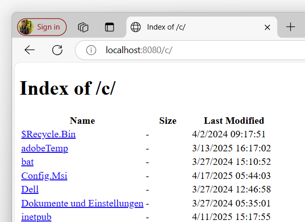

---
title: Routing
description: 
weight: 1
cascade:
  type: docs
---

When the server receives a request from the client, it passes it to the root handler
specified by your application. Depending on the requested path, this handler
may invoke additional handlers to actually produce a response. The tree of handlers
available in your application is called *handler chain*. As requests are passed
from one handler to another, they need to track, which segments of the requested
path have already been considered and which still need to be evaluated,
effectively decoupling them from each other. This
capability is provided by the routing feature of the framework.

To track the processing of the current route, the `IRequest` exposes a `Target`
property which provides the routing state. This object provides the `Current` segment
to be handled as well as the ability to move to the next segment by calling
the `Advance()` method.

To illustrate this concept, we will write a simple handler that exposes all drives
on a Windows system by analyzing the requested drive and passing the request
along to the [listing handler](../../handlers/listing/).

The handler first inspects the `Current` segment to be handled, therefore
reading the drive to be listed. If a drive name has been passed by the client,
we will `Advance()` our routing target so the listing handler can inspect the remaining
segments without re-analyzing the drive name once again.

```csharp
using GenHTTP.Api.Content;
using GenHTTP.Api.Protocol;
using GenHTTP.Engine.Internal;
using GenHTTP.Modules.DirectoryBrowsing;
using GenHTTP.Modules.IO;
using GenHTTP.Modules.Practices;

await Host.Create()
          .Handler(new DriveListingHandler())
          .Defaults()
          .Development()
          .Console()
          .RunAsync();

public class DriveListingHandler : IHandler
{

    public ValueTask PrepareAsync() => ValueTask.CompletedTask;

    public async ValueTask<IResponse?> HandleAsync(IRequest request)
    {
        var drive = request.Target.Current?.Value;

        if (drive != null)
        {
            request.Target.Advance();

            return await Listing.From(ResourceTree.FromDirectory($"{drive}:\\"))
                                .Build()
                                .HandleAsync(request);
        }
        
        return null;
    }
    
}
```

Running this program allows us to open URLs such as http://localhost:8080/c/ in the browser to
retrieve a small listing UI for a drive.

