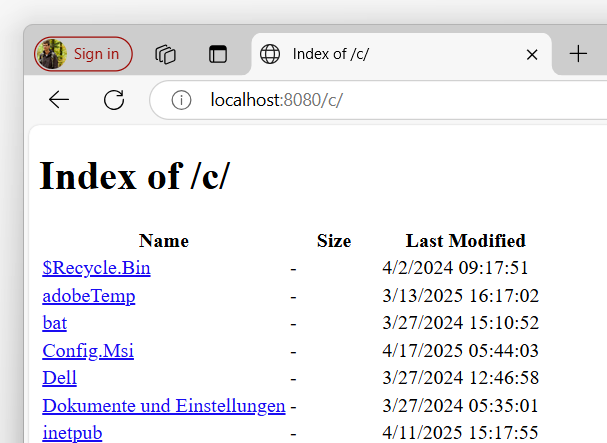

---
title: Routing
description: 
weight: 1
cascade:
  type: docs
---

When the server receives a request from the client, it passes it to the root handler
specified by your application. Depending on the requested path, this handler
may invoke additional handlers to actually produce a response. The tree of handlers
available in your application is called *handler chain*. As requests are passed
from one handler to another, they need to track, which segments of the requested
path have already been considered and which still need to be evaluated,
effectively decoupling them from each other. This
capability is provided by the routing feature of the framework.

To track the processing of the current route, the `IRequest` exposes an `IRequestTarget`
via `request.Header.Target`. This object provides the `Current` segment to be handled as
well as the ability to move to the next segment by calling the `Advance()` method.

```csharp
public interface IRequestTarget
{

    PathSegment? Current { get; }

    bool IsLast { get; }

    bool HasTrailingSlash { get; }

    void Advance(int segments = 1);

    PathSegment? Next(int offset);

    IRequestTarget CopyAndAppend(ReadOnlyMemory<byte> suffix);

    string AsString(bool decode = true, bool remainingOnly = false);

}
```

`Current` is a `PathSegment`, a percent-encoded slice of the requested path. Call `Decode()`
on it to get the human-readable, percent-decoded string; its plain `ToString()` returns the
raw, still-encoded segment. `IsLast` tells you whether this is the final segment of the path,
and `HasTrailingSlash` whether the original path ended in `/`. To read everything that has
not been routed yet in one go (e.g. to hand it to another framework), use
`AsString(remainingOnly: true)` instead of walking segments manually.

To illustrate this concept, we will write a simple handler that exposes all drives
on a Windows system by analyzing the requested drive and passing the request
along to the [listing handler](../../handlers/listing/).

The handler first inspects the `Current` segment to be handled, therefore
reading the drive to be listed. If a drive name has been passed by the client,
we will `Advance()` our routing target so the listing handler can inspect the remaining
segments without re-analyzing the drive name once again.

```csharp
using GenHTTP.Api.Content;
using GenHTTP.Api.Infrastructure;
using GenHTTP.Api.Protocol;
using GenHTTP.Engine.Internal;
using GenHTTP.Modules.DirectoryBrowsing;
using GenHTTP.Modules.IO;
using GenHTTP.Modules.Practices;

await Host.Create()
          .Handler(new DriveListingHandler())
          .Defaults()
          .Development()
          .RunAsync();

public class DriveListingHandler : IHandler
{

    public ValueTask PrepareAsync(IServer server) => ValueTask.CompletedTask;

    public async ValueTask<IResponse?> HandleAsync(IRequest request)
    {
        var drive = request.Header.Target.Current?.Decode();

        if (drive != null)
        {
            request.Header.Target.Advance();

            return await Listing.From(ResourceTree.FromDirectory($"{drive}:\\"))
                                .Build()
                                .HandleAsync(request);
        }
        
        return null;
    }
    
}
```

Running this program allows us to open URLs such as http://localhost:8080/c/ in the browser to
retrieve a small listing UI for a drive.



## Suffix Routing

Some handlers need to check whether a variant of the requested resource exists under a
modified path - for example, whether a precompressed `file.css.br` exists next to
`file.css`. `CopyAndAppend()` creates a copy of the current routing target with a suffix
appended, keeping the same routing state (i.e. how many segments have already been
advanced) as the original:

```csharp
var target = request.Header.Target;

var compressed = target.CopyAndAppend(".br"u8.ToArray());
```