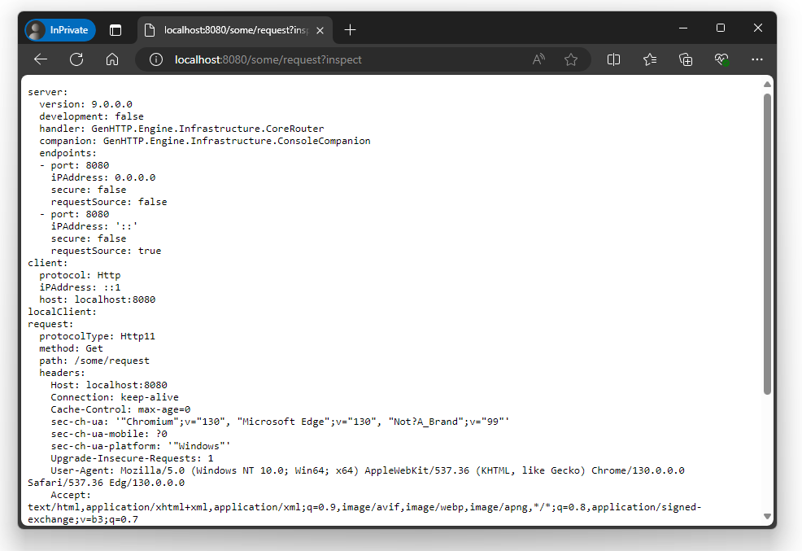

---
title: Inspection
description: 'Inspect requests and responses as seen by the GenHTTP webserver'
cascade:
type: docs
---





When developing client applications, you will sometimes have trouble to understand, why you are getting a 
specific response from a webserver. The inspection concern allows you to add the query param `?inspect` to any
request and will respond with a detailed summary of how the received request looked like and what response
was generated by the server.

```csharp
using GenHTTP.Engine;

using GenHTTP.Modules.Inspection;
using GenHTTP.Modules.Layouting;
using GenHTTP.Modules.Practices;

var app = Layout.Create()
                .AddInspector();

await Host.Create()
          .Handler(app)
          .Defaults()
          .Console()
          .RunAsync();
```

When running this example and opening http://localhost:8080/some/request?inspect in your browser, you will get a summary of
the request that was issued by the client:



With this concern in place, you can add the query parameter to the request generated by your client and convert the response
sent by the server into a string to view the summary.

## Custom Serialization

By default, the response generated by the inspector will be serialized as YAML to be human readable. You can adjust
this behavior by passing a custom serialization registry to the builder. The following example will serialize to JSON
instead:

```csharp
using GenHTTP.Api.Protocol;

using GenHTTP.Engine;

using GenHTTP.Modules.Conversion;
using GenHTTP.Modules.Conversion.Serializers.Json;
using GenHTTP.Modules.Inspection;
using GenHTTP.Modules.Layouting;
using GenHTTP.Modules.Practices;

var serialization = Serialization.Empty()
                                 .Default(ContentType.ApplicationJson)
                                 .Add(ContentType.ApplicationJson, new JsonFormat())
                                 .Build();

var inspection = Inspector.Create().Serialization(serialization);

var app = Layout.Create()
                .Add(inspection);
```
