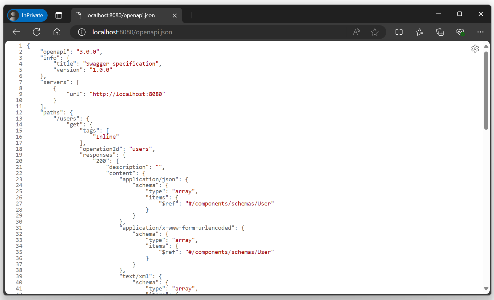
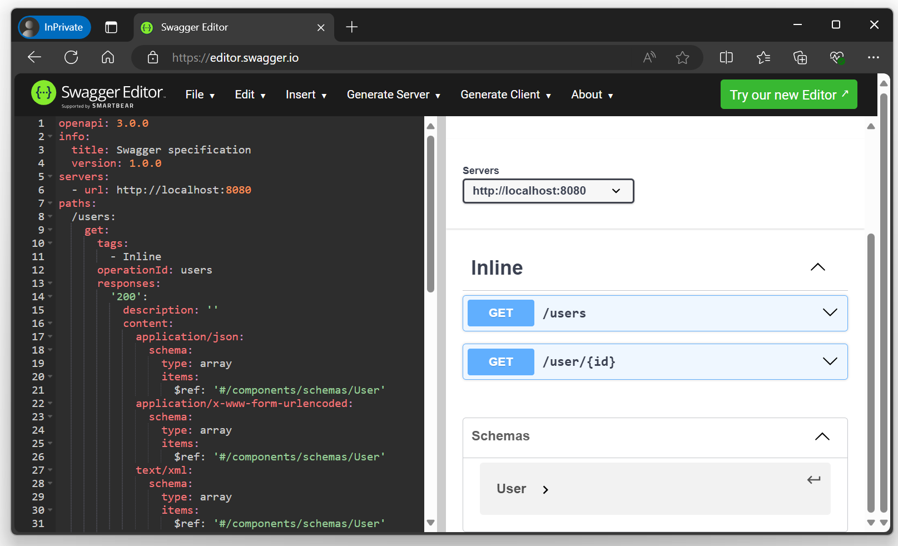

---
title: Open API
description: 'Dynamically generates an Open API v3 specification for a web service or controller'
cascade:
type: docs
---





This concern dynamically generates and serves an [Open API v3 specification](https://github.com/OAI/OpenAPI-Specification) using 
[NSwag](https://github.com/RicoSuter/NSwag) for all detected API endpoints.

```csharp
using GenHTTP.Engine;

using GenHTTP.Modules.Functional;
using GenHTTP.Modules.OpenApi;

var api = Inline.Create()
                .Get("/users", () => new List<User>())
                .Get("/user/:id", (int id) => new User(id, "John Doe"))
                .AddOpenApi();

Host.Create()
    .Handler(api)
    .Development()
    .Console()
    .Run();

record User(int ID, string Name);
```

This example provides a functional API with two operations and hosts a self-describing
Open API specification via http://localhost:8080/openapi.json.



You can import this specification into other tools such as [Postman](https://www.postman.com/)
or [Swagger Editor](https://editor.swagger.io/) to execute requests or generate client implementations.



## Endpoints

The Open API concern provides the following endpoints:

| Endpoint        | Description                                                                                   |
|-----------------|-----------------------------------------------------------------------------------------------|
| `/openapi.json` | Open API specification serialized to `application/json`.                                      |
| `/openapi.yaml` | Open API specification serialized to `application/yaml`.                                      |
| `/openapi.yml`  | Open API specification serialized to `application/yaml`.                                      |
| `/openapi`      | Serialized depending on the `Accept` header of the request, falls back to `application/json`. |

## Customizing

To customize the generated specification you can pass a function that will be executed
just before the document is serialized and sent to the requesting client.

```csharp
using GenHTTP.Engine;

using GenHTTP.Modules.Functional;
using GenHTTP.Modules.OpenApi;

var description = ApiDescription.Create()
                                .Title("My awesome API")
                                .Version("2.0.7")
                                .PostProcessor((r, doc) => doc.Info.TermsOfService = "https://mycompany.com/tos");

var api = Inline.Create()
                .Add(description);

Host.Create()
    .Handler(api)
    .Development()
    .Console()
    .Run();
```

Please note that method annotations are currently not supported, besides the `[Obsolete]` attribute
marking an operation as deprecated. You will find the corresponding [feature request](https://github.com/Kaliumhexacyanoferrat/GenHTTP/issues/525) on GitHub.

## Caching

As automatically generating a specification is an expensive task, the concern will cache
the generated document for improved performance. In some cases you might want
the specification to be generated on every request, especially if the result depends on the
request sent by the client. In this case, you can disable caching, causing the
document to be generated on every request.

```csharp
var description = ApiDescription.Create()
                                .Caching(false);
```

## Custom Discovery

By default, automatic discovery will handle [functional handlers](../frameworks/functional),
[webservices](../frameworks/webservices) and [controllers](../frameworks/controllers)
and will traverse automatically through [layouts](../handlers/layouting) and
[concerns](../concerns/). If you would like to support an additional handler, you can
initialize a registry and pass a custom `IApiExplorer`.

The following example adds support for redirects, so the generated Open API specification
will describe the operation.

```csharp
using GenHTTP.Api.Content;
using GenHTTP.Engine;
using GenHTTP.Modules.Basics;
using GenHTTP.Modules.Basics.Providers;
using GenHTTP.Modules.Layouting;
using GenHTTP.Modules.OpenApi;
using GenHTTP.Modules.OpenApi.Discovery;
using NSwag;

var discovery = ApiDiscovery.Default()
                            .Add<RedirectExplorer>();

var description = ApiDescription.With(discovery).Caching(false);

var api = Layout.Create()
                .Add("google", Redirect.To("https://google.com"))
                .Add(description);

Host.Create()
    .Handler(api)
    .Development()
    .Console()
    .Run();

class RedirectExplorer : IApiExplorer
{

    public bool CanExplore(IHandler handler) => handler is RedirectProvider;

    public void Explore(IHandler handler, List<string> path, OpenApiDocument document, SchemaManager schemata, ApiDiscoveryRegistry registry)
    {
        if (handler is RedirectProvider redirect)
        {
            var apiPath = OpenApiExtensions.BuildPath(string.Empty, path);

            var pathItem = new OpenApiPathItem();

            var operation = new OpenApiOperation();

            var response = new OpenApiResponse();

            response.Headers.Add("Location", new OpenApiHeader() { Default = redirect.Target });

            var status = redirect.Temporary ? "307" : "308";

            operation.Responses.Add(status, response);

            pathItem.Add("get", operation);

            document.Paths.Add(apiPath, pathItem);
        }
    }

}
```

If you would like to have an API explorer for a handler that is shipped with the framework,
feel free to get in touch via a GitHub issue or via Discord. 
