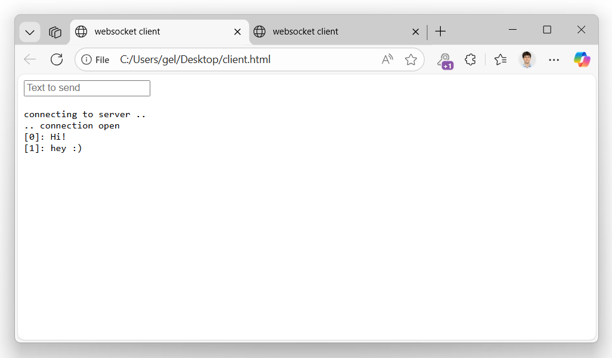





The websocket handler integrates [Fleck](https://github.com/statianzo/Fleck) to upgrade client connections so that you
can use websocket functionality in your application.


A project serving a websocket can quickly be created by using a [project template](../../templates/).


The following example hosts a simple console application that provides a websocket server that will echo received messages back
to connected clients:

```csharp
using GenHTTP.Engine.Internal;
using GenHTTP.Modules.Practices;
using GenHTTP.Modules.Websockets;

var allSockets = new List<IWebsocketConnection>();

var websocket = Websocket.Create()
                         .OnOpen((socket) =>
                         {
                             Console.WriteLine("Open!");
                             allSockets.Add(socket);
                         })
                         .OnClose((socket) =>
                         {
                             Console.WriteLine("Close!");
                             allSockets.Remove(socket);
                         })
                         .OnMessage((socket, message) =>
                         {
                             Console.WriteLine(message);
                             allSockets.ToList().ForEach(s => s.Send("Echo: " + message));
                         });

var host = Host.Create()
    .Handler(websocket)
    .Defaults()
    .Development()
    .Console();

await host.StartAsync();

var input = Console.ReadLine();

while (input != "exit")
{
    if (input != null)
    {
        foreach (var socket in allSockets.ToList())
        {
            await socket.Send(input);
        }
    }

    input = Console.ReadLine();
}

await host.StopAsync();
```

After starting the server, you can open the following HTML page (provided by the Fleck project as a sample)
in your browser to connect to the server:

```html
<!DOCTYPE HTML PUBLIC "-//W3C//DTD HTML 4.0 Transitional//EN">
<html>
<head>
    <title>websocket client</title>
    <script type="text/javascript">
        var start = function () {
            var inc = document.getElementById('incomming');
            var wsImpl = window.WebSocket || window.MozWebSocket;
            var form = document.getElementById('sendForm');
            var input = document.getElementById('sendText');
            
            inc.innerHTML += "connecting to server ..<br/>";

            // create a new websocket and connect
            window.ws = new wsImpl('ws://localhost:8080/');

            // when data is comming from the server, this metod is called
            ws.onmessage = function (evt) {
                inc.innerHTML += evt.data + '<br/>';
            };

            // when the connection is established, this method is called
            ws.onopen = function () {
                inc.innerHTML += '.. connection open<br/>';
            };

            // when the connection is closed, this method is called
            ws.onclose = function () {
                inc.innerHTML += '.. connection closed<br/>';
            }
            
			form.addEventListener('submit', function(e){
				e.preventDefault();
				var val = input.value;
				ws.send(val);
				input.value = "";
			});
            
        }
        window.onload = start;
    </script>
</head>
<body>
	<form id="sendForm">
		<input id="sendText" placeholder="Text to send" />
	</form>
    <pre id="incomming"></pre>
</body>
</html>

```

Every browser instance of this page will connect to the server and show messages entered in the
server app or any other browser window.


