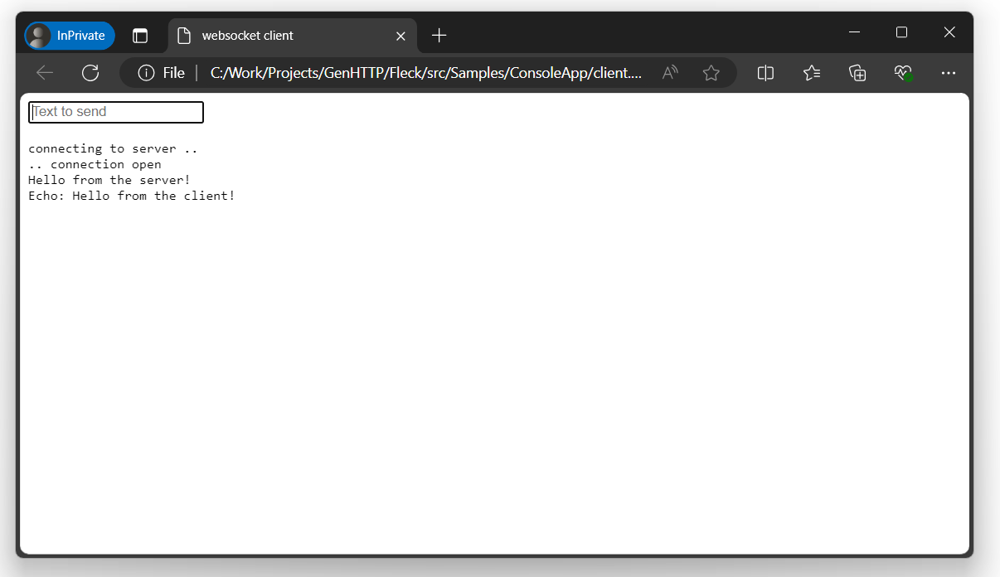





Websockets allow to create a bidirectional connection between your clients and your server,
allowing both sides to push content without the need of sending HTTP requests.


A project serving a websocket can quickly be created by using a [project template](../../templates/).


## Flavors

There are four different kind of flavors that you can use to host a web socket endpoint. The template uses
the reactive approach, but you can choose one of them based on your personal preference
and project needs. They do not differ in functionality. In this section we will spawn
a simple websocket server that will relay incoming messages to all other connected clients
(so basically a simple chat application). In the "Client" section you will find a simple
HTML file that can be opened in a browser to connect to your server.

### Reactive

This flavor allows you to pass a handler instance that needs to implement `IReactiveHandler` 
and will be notified when a client connects to your endpoint and starts to send messages. The `connection` provided
as a parameter in the handler functions allows you to send data to the connected client.

```csharp
using GenHTTP.Engine.Internal;

using GenHTTP.Modules.Practices;
using GenHTTP.Modules.Websockets;

var websocket = Websocket.Reactive()
                         .Handler(new ChatHandler());

await Host.Create()
          .Handler(websocket)
          .Defaults()
          .Development()
          .Console()
          .RunAsync();

class ChatHandler : IReactiveHandler
{
    private static readonly List<IReactiveConnection> Clients = [];

    public ValueTask OnConnected(IReactiveConnection connection)
    {
        Clients.Add(connection);
        return ValueTask.CompletedTask;
    }

    public async ValueTask OnMessage(IReactiveConnection connection, IWebsocketFrame message)
    {
        var clientNumber = Clients.IndexOf(connection);
        
        foreach (var client in Clients)
        {
            await client.WriteAsync($"[{clientNumber}]: " + message.DataAsString());
        }
    }

    public ValueTask OnClose(IReactiveConnection connection, IWebsocketFrame message)
    {
        Clients.Remove(connection);
        return ValueTask.CompletedTask;
    }

}
```

### Functional

The functional flavor is very similar to the reactive one, but instead of passing a 
handler, you can directly define the event handlers on the builder:

```csharp
using GenHTTP.Engine.Internal;

using GenHTTP.Modules.Practices;
using GenHTTP.Modules.Websockets;

var websocket = Websocket.Reactive()
                         .Handler(new ChatHandler());

await Host.Create()
          .Handler(websocket)
          .Defaults()
          .Development()
          .Console()
          .RunAsync();

class ChatHandler : IReactiveHandler
{
    private static readonly List<IReactiveConnection> Clients = [];

    public ValueTask OnConnected(IReactiveConnection connection)
    {
        Clients.Add(connection);
        return ValueTask.CompletedTask;
    }

    public async ValueTask OnMessage(IReactiveConnection connection, IWebsocketFrame message)
    {
        var clientNumber = Clients.IndexOf(connection);

        foreach (var client in Clients)
        {
            await client.WriteAsync($"[{clientNumber}]: " + message.DataAsString());
        }
    }

    public ValueTask OnClose(IReactiveConnection connection, IWebsocketFrame message)
    {
        Clients.Remove(connection);
        return ValueTask.CompletedTask;
    }

}
```

### Imperative

While the functional and reactive flavor already dispatch incoming websocket frames
to specific methods, the imperative mode requires you to provide the message
loop yourself. This gives you more control over the connection, but requires a little bit
more effort.

```csharp
using GenHTTP.Engine.Internal;

using GenHTTP.Modules.Practices;
using GenHTTP.Modules.Websockets;
using GenHTTP.Modules.Websockets.Protocol;

var websocket = Websocket.Imperative()
                         .Handler(new ChatHandler());

await Host.Create()
          .Handler(websocket)
          .Defaults()
          .Development()
          .Console()
          .RunAsync();

class ChatHandler : IImperativeHandler
{
    private static readonly List<IImperativeConnection> Clients = [];

    public async ValueTask HandleAsync(IImperativeConnection connection)
    {
        Clients.Add(connection);

        var clientNumber = Clients.IndexOf(connection);
        
        do
        {
            var message = await connection.ReadFrameAsync();

            if (message.Type == FrameType.Ping)
            {
                await connection.PongAsync();
            }
            else if (message.Type == FrameType.Text)
            {
                foreach (var client in Clients)
                {
                    await client.WriteAsync($"[{clientNumber}]: " + message.DataAsString());
                }
            }
            else if (message.Type == FrameType.Close)
            {
                await connection.CloseAsync();
                break;
            }
        }
        while (connection.Request.Server.Running);
        
        Clients.Remove(connection);
    }
    
}
```

### Legacy

This flavor is similar to the functional one but uses [Fleck](https://github.com/statianzo/Fleck),
an external dependency, to provide the functionality. This flavor is deprecated and will be 
removed in GenHTTP 11.

```csharp
using GenHTTP.Engine.Internal;

using GenHTTP.Modules.Practices;
using GenHTTP.Modules.Websockets;

List<IWebsocketConnection> clients = [];

var websocket = Websocket.Create()
                         .OnOpen(c =>
                         {
                             clients.Add(c);
                             return Task.CompletedTask;
                         })
                         .OnMessage(async (c, m) =>
                         {
                             var clientNumber = clients.IndexOf(c);

                             foreach (var client in clients)
                             {
                                 await client.SendAsync($"[{clientNumber}]: " + m);
                             }
                         })
                         .OnClose(c =>
                         {
                             clients.Remove(c);
                             return Task.CompletedTask;
                         });

await Host.Create()
          .Handler(websocket)
          .Defaults()
          .Development()
          .Console()
          .RunAsync();
```

### Client

After starting the server, you can open the following HTML page in your browser to connect to the server:

```html
<!DOCTYPE HTML PUBLIC "-//W3C//DTD HTML 4.0 Transitional//EN">
<html>
<head>
    <title>websocket client</title>
    <script type="text/javascript">
        var start = function () {
            var inc = document.getElementById('incoming');
            var wsImpl = window.WebSocket || window.MozWebSocket;
            var form = document.getElementById('sendForm');
            var input = document.getElementById('sendText');
            
            inc.innerHTML += "connecting to server ..<br/>";

            // create a new websocket and connect
            window.ws = new wsImpl('ws://localhost:8080/');

            // when data is coming from the server, this method is called
            ws.onmessage = function (evt) {
                inc.innerHTML += evt.data + '<br/>';
            };

            // when the connection is established, this method is called
            ws.onopen = function () {
                inc.innerHTML += '.. connection open<br/>';
            };

            // when the connection is closed, this method is called
            ws.onclose = function () {
                inc.innerHTML += '.. connection closed<br/>';
            }
            
			form.addEventListener('submit', function(e){
				e.preventDefault();
				var val = input.value;
				ws.send(val);
				input.value = "";
			});
            
        }
        window.onload = start;
    </script>
</head>
<body>
	<form id="sendForm">
		<input id="sendText" placeholder="Text to send" />
	</form>
    <pre id="incoming"></pre>
</body>
</html>

```

Every browser instance of this page will connect to the server and show messages entered in browser window.



## Further Considerations

In contrast to regular webservice handlers, websockets can be used for long-running
processes and to inform clients about events that happen in your systems. As this changes
the typical request/response characteristic of a web server, there are things to be considered
when implementing a websocket handler, which will be discussed in this section.

### Long-running Tasks

In the default implementation of the reactive and functional handler, the server waits
for the user code to be finished before processing the next incoming frame. This means that
long-running jobs executed within your handler methods will block the message pump of the websocket,
causing ping requests not to be answered, eventually causing the client to drop the connection to
the server. Therefore, if you would like to execute a long-running task from a message handler,
you should spawn a new task for it, so the handler can directly return to the message loop.

As creating new tasks introduces additional overhead and context switches, this behavior
is not provided by the web server and needs to be manually implemented.

```csharp
private Task? _importJob;

private readonly CancellationTokenSource _cancellationTokenSource = new();

public ValueTask OnMessage(IReactiveConnection connection, IWebsocketFrame message)
{
    _importJob = Task.Run(() => { /* ... */ }, _cancellationTokenSource.Token);
    return ValueTask.CompletedTask;
}

public ValueTask OnClose(IReactiveConnection connection, IWebsocketFrame message)
{
    _cancellationTokenSource.Cancel();
    return ValueTask.CompletedTask;
}
```

### Synchronizing Write Access

Depending on your use case, you might want to write to the websocket connection
from different threads as relevant events happen in your system. As the websocket
connection is not thread safe, you need to synchronize write access manually, e.g. via
an additional extension method:

```csharp
public static class WebsocketSynchronizationExtensions
{
    private static readonly SemaphoreSlim WriteLock = new(1, 1);
    
    public static async ValueTask WriteSynchronizedAsync(this ISocketConnection connection, string payload, FrameType opcode = FrameType.Text, bool fin = true, CancellationToken token = default)
    {
        await WriteLock.WaitAsync(token);
        
        try
        {
            await connection.WriteAsync(Encoding.UTF8.GetBytes(payload), opcode, fin, token: token);
        }
        finally
        {
            WriteLock.Release();
        }
    } 

}
```

### Continuation Handling

If a client sends a large chunk of data, browsers may segment this data
into multiple continuation messages (usually happens for payloads bigger
then 16 KB). The websocket handler will collect those frames and automatically
merge them into a single `IWebsocketFrame` passed to your logic.

If you would like to handle continuation frames yourself, you can call
`.HandleContinuationFramesManually()` on the builder instances and will
start to receive frames with `Type` being set to `Continue`.

## Allocation Handling

By default, the websocket handler will allocate a new buffer per frame to
keep the data available after the next message has already been read from
the underlying connection. This allows user to store frames or their `Data`.

For high performance scenarios, you can disable this automatic allocation 
by calling `.DoNotAllocateFrameData()` on the builder and access the raw buffer 
via `frame.Raw.Memory` (or `frame.Raw.Segments` for a message consisting
of multiple continuation frames).
