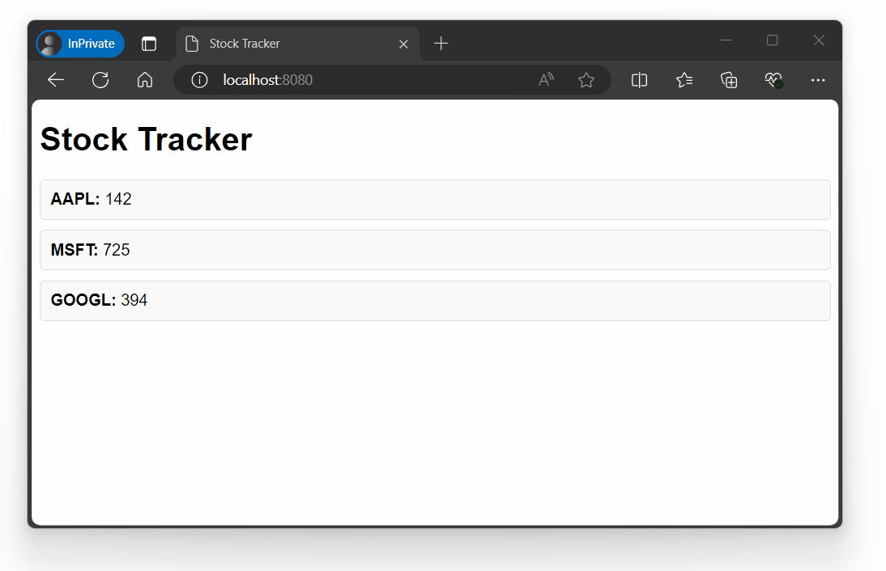

---
title: Server Sent Events (SSE)
description: 'Handler written in C# to generate a stream of events and sends them to connected clients.'
cascade:
  type: docs
---





[Server Sent Events (SSE)](https://html.spec.whatwg.org/multipage/server-sent-events.html#server-sent-events) allow client applications such as
browsers to subscribe to a stream of relevant events without the overhead added by the bi-directional connection
of websockets. Therefore they are useful whenever the server would like to notify the client about changes.

## Example

The following example will host a SSE endpoint that will stream
randomly generated updates on stock prices to a client until it disconnects.

```csharp
using GenHTTP.Engine;

using GenHTTP.Modules.IO;
using GenHTTP.Modules.Layouting;
using GenHTTP.Modules.Practices;
using GenHTTP.Modules.ServerSentEvents;

var client = Content.From(Resource.FromAssembly("Client.html"));

var stocks = EventSource.Create()
                        .Generator(GenerateStock);

var app = Layout.Create()
                .Add("stock", stocks)
                .Index(client);

Host.Create()
    .Handler(app)
    .Defaults()
    .Development()
    .Console()
    .Run();

static async ValueTask GenerateStock(IEventConnection connection)
{
    var rand = new Random();

    var stockSymbols = new List<string> { "AAPL", "GOOGL", "MSFT" };

    await connection.CommentAsync("Sending stock data");

    while (connection.Connected)
    {
        var symbol = stockSymbols[rand.Next(0, 3)];

        await connection.DataAsync(rand.Next(100, 1000), symbol);

        await Task.Delay(1000);
    }

}
```

For the client to be served, create a new `Client.html` in your project, mark it
as `Embedded Resource` and paste the following content:

```html
<!DOCTYPE html>
<html lang="en">
<head>
    <meta charset="UTF-8">
    <meta name="viewport" content="width=device-width, initial-scale=1.0">
    <title>Stock Tracker</title>
    <style>
        body {
            font-family: Arial, sans-serif;
        }
        #stocks {
            display: flex;
            flex-direction: column;
            gap: 10px;
            margin-top: 20px;
        }
        .stock {
            padding: 10px;
            border: 1px solid #ddd;
            border-radius: 5px;
            background-color: #f9f9f9;
        }
    </style>
</head>
<body>
<h1>Stock Tracker</h1>
<div id="stocks"></div>

<script>
    // Establish a connection to the server using Server-Sent Events
    const eventSource = new EventSource('http://localhost:8080/stock/');

    // Function to display stock updates
    function updateStock(symbol, value) {
        let stockElement = document.getElementById(symbol);

        if (!stockElement) {
            // Create a new element for the stock symbol if it doesn't exist
            stockElement = document.createElement('div');
            stockElement.id = symbol;
            stockElement.className = 'stock';
            document.getElementById('stocks').appendChild(stockElement);
        }

        // Update stock value
        stockElement.innerHTML = `<strong>${symbol}:</strong> ${value}`;
    }

    // Event listener for general updates
    eventSource.onmessage = function(event) {
        updateStock(event.type, event.data);
    };

    // Event listeners for specific stock symbols
    const symbols = ['AAPL', 'GOOGL', 'MSFT']; // Example stocks
    symbols.forEach(symbol => {
        eventSource.addEventListener(symbol, event => {
            updateStock(symbol, event.data);
        });
    });

    // Error handling
    eventSource.onerror = function() {
        console.error('Connection to the server lost.');
    };
</script>
</body>
</html>
```

After running this sample and navigating to http://localhost:8080 in your browser,
you will see a simple web application consuming the generated events:



## Sending Data

The `Generator` passed to the `EventSource` receives an `IEventConnection` that
allows you to interact with the connected client. As the specification allows
string messages only, there are some convenience methods to format .NET types 
on the wire.

```csharp
EventSource.Create()
           .Generator(async (connection) => {

                await connection.CommentAsync("this is a comment");

                await connection.DataAsync("string message");
    
                // formatted to string
                await connection.DataAsync(42.1);
    
                // serialized to JSON
                await connection.DataAsync(new List<string>() { "4711" });
    
           });
```

The formatters support basic types such as `int`, `float`, `bool` or `DateOnly`. You can customize this
behavior by adding a custom formatter registry to the source:

```csharp
var registry = Formatting.Default()
                         .Add(new MyFormat());

var eventSource = EventSource.Create()
                             .Formatting(registry)
                             .Generator(...);
```

### Event Types

When sending data, you can optionally specify a custom chosen event
type. This allows clients to subscribe to the events they are interested in.

```csharp
await connection.DataAsync("user xyz logged in", eventType: "UserLogin");
```

### Event IDs

Event IDs allow you to establish a protocol where the client can tell which events
they already consumed and the server resumes the event stream from this point on.

```csharp
await connection.DataAsync("some event", eventId: "4711");
```

With this information, the client can specify the `Last-Event-ID` they consumed using a 
HTTP header field when connecting to the server. This information is made
available via `connection.LastEventId`.

### Parameters

The `IEventConnection` provides access to the underlying HTTP request via `connection.Request`, so
you can use query parameters or the request path to pass arguments to your logic:

```csharp
// http://localhost:8080/events?user=123

var userId = connection.Request.Query["user"];

// http://localhost:8080/events/type

var eventType = connection.Request.Target.Current.Value;
```

## Connection Lifecycle

Most scenarios will keep the connection to a client open until it disconnects from their side.
This implies some loop that can be achieved using the `Connected` property of the connection:

```csharp
while (connection.Connected) 
{
    // wait for data and generate events    
}
```

Please note that the server will only recognize that a client is no longer
connected when it tries to send data. Therefore, all of the `Data` methods will
return a boolean value indicating whether the operation succeeded or not. If an operation
fails, the `Connected` property will be set to `false` allowing your loop to exit on the
next evaluation.

If the server has no events to be sent to the client, it is recommended by the specification to
periodically send comments to prevent proxy servers from cancelling the running request and to
verify that the client is still connected.

If the server has no data for a connecting client and will most likely not produce any, the server
can indicate this to the client by sending a `204 No Content` response. This way the server does not
have to maintain an open connection that will not be used for communication. For this purpose, the
API allows to pass an `Inspector` that will be called before the generator is invoked to produce
events.

```csharp
EventSource.Create()
           .Inspector(Inspect)
           .Generator(...);

private ValueTask<bool> Inspect(IRequest request, string? lastEventId) 
{
    // return false to close the connection and instruct the client no to connect again
    return new(false);
}
```

If a source system required to generate events is not available or it is clear that there will
be no events for the client in the near future, you can also instruct the client to reconnect at a 
later point in time:

```csharp
// instructs the client to reconnect in five minutes
await connection.RetryAsync(new(0, 5, 0));
```

After a retry message has been sent, the connection can no longer be used to send any messages and
should be closed immediately by exiting the generator delegate.

## Error Handling

By default, the `EventSource` handler will catch any exception that occurs in the generator logic, log
it to the server companion and instruct the client to reconnect after 10 seconds. As the HTTP headers for the
event stream have already been sent, there is no general mechanism to inform the client about errors. This
can be achieved by adding your own `try/catch` block to your generator:

```csharp
try 
{
    // generate events    
}
catch (Exception e) 
{
    // log the error, inform the client, and instruct them to reconnect
    // put your custom error handling logic here
    
    Console.WriteLine(e);
    
    await connection.DataAsync(e.Message, eventType: "OnError");
    
    await connection.RetryAsync(new(0, 0, 10));
}
```
