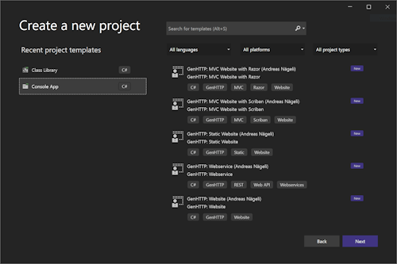

---
title: Templates
description: Create new webservices and websites in a couple of minutes.
weight: 1
cascade:
  type: docs
---

Templates allow to create new projects based on the GenHTTP SDK
(such as webservices or websites) in a couple of minutes. To
install the project templates in your environment run the following
command in your terminal:

```bash
dotnet new -i GenHTTP.Templates
```

After the templates have been installed, new projects can be created
using the following commands:

```bash
mkdir AppName
cd AppName
dotnet new <template-name>
```

If installed, the templates will also show up in Visual Studio and can
be used from there to quickly create new projects:



The following templates are available to be used:

| Template                         | Description                                                                                                              | 
|----------------------------------|--------------------------------------------------------------------------------------------------------------------------| 
| `genhttp-webservice`             | A project that will host a new [REST web service](../frameworks/webservices).                                            |
| `genhttp-webservice-minimal`     | A project that will host a minimal web service in a single file using the [functional module](../frameworks/functional). |
| `genhttp-webservice-controllers` | A project that will host a web service using [controllers](../frameworks/controllers).                                   |  
| `genhttp-websocket`              | A project that will host a new [web socket](../frameworks/websockets).                                                   |
| `genhttp-website-static`         | Serves a [static website](../frameworks/static-websites) from the file system.                                           |
| `genhttp-spa`                    | Serves the distribution files of a [Single Page Application (SPA)](../frameworks/single-page-applications).              |

After creating the project, you can run it with `dotnet run` which make the application
available on [http://localhost:8080](http://localhost:8080).

## Updating Templates

To update your locally installed project templates, run the following
command in your terminal:

```bash
dotnet new update
```
