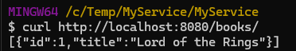

This tutorial will show you how to create, run and test a new web service implemented
with the GenHTTP framework.

## Prerequisites

For this tutorial you will need

- the [.NET SDK](https://dotnet.microsoft.com/en-us/download) to be installed on your machine
- optionally an IDE of your choice, such as [Visual Studio](https://visualstudio.microsoft.com/), [VS Code](https://visualstudio.microsoft.com/) or [Rider](https://www.jetbrains.com/rider/)

## Creating the Project

The easiest way of creating a new webservice is by using a [project template](../../content/templates/). If not already
done, install the templates by executing the following command in your terminal:

```bash
dotnet new -i GenHTTP.Templates
```

After the templates have been installed, you can create a new folder for your project and use the webservice
template to create the project:

```bash
mkdir MyService
cd MyService

dotnet new genhttp-webservice
```

After the command has been executed the content of the folder should look something like this:


  
    
    
      
    
    
    
    
  

  

  
  



If you are using an IDE, you can open the file `MyService.csproj` to load your project there.
The `Program.cs` is the main entry point of your service and is used to set up your server instance.
In `Project.cs` our web service is actually defined and configured. The `BookService.cs` is 
an example service provided by our project.

## Running the Project

After the project has been created, you can navigate to the service project in your terminal (`cd MyService`)
and run the project from there:

```bash
dotnet run
```

Alternatively you can directly run the project from your IDE (`F5` in Visual Studio).

This will start the server process and make your app available on [http://localhost:8080](http://localhost:8080).
To actually invoke a service method you can navigate to [http://localhost:8080/books/](http://localhost:8080/books/) in your browser or by using
any other HTTP client tool (such as curl or Postman).



## Testing the Project

Together with the actual service project, the template also created a test project that ensures
that your service works the way it should. You can either run the tests from your IDE
or by executing the following command in the `MyService.Tests` folder:

```bash
dotnet test
```

## Implementing your Service

You now have the basic setup to run and test your service project. To actually implement
your service, you can add new service classes to the `Services` directory and register them
in the `Project.cs`.

```csharp
.AddService<AnotherService>("another")
```

## Next Steps

The documentation will show you the details of the web service framework as well
as all other aspects that are relevant when developing an webservice application
using the GenHTTP framework.



  

  

  


