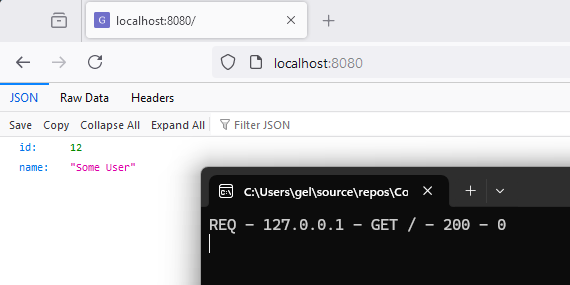

This tutorial will show you how to create a webservice with the GenHTTP framework with
just two lines of code. You can use this as a minimal starting point if you would 
not like to use a project template. This tutorial works both for new projects
and already existing ones.

## Prerequisites

For this tutorial you will need

- the [.NET SDK](https://dotnet.microsoft.com/en-us/download) to be installed on your machine
- optionally an IDE of your choice, such as [Visual Studio](https://visualstudio.microsoft.com/), [VS Code](https://visualstudio.microsoft.com/) or [Rider](https://www.jetbrains.com/rider/)

## Creating the Project

To create a new project, create a folder and add a new file named `Project.csproj` with
the following content. If you already have an existing project, just add the `PackageReference`
entries to your project file.

```xml
<Project Sdk="Microsoft.NET.Sdk">

  <PropertyGroup>
    <OutputType>Exe</OutputType>
    <TargetFramework>net9.0</TargetFramework>
    <ImplicitUsings>enable</ImplicitUsings>
    <Nullable>enable</Nullable>
  </PropertyGroup>

  <ItemGroup>
    <PackageReference Include="GenHTTP.Core" Version="9.0.0" />
    <PackageReference Include="GenHTTP.Modules.Functional" Version="9.0.0" />
  </ItemGroup>

</Project>
```

In the same directory, create a file named `Program.cs` and add the following content.

```csharp
using GenHTTP.Engine;

using GenHTTP.Modules.Functional;
using GenHTTP.Modules.Practices;

var service = Inline.Create()
                    .Get(() => new { ID = 12, Name = "Some User" });

Host.Create()
    .Handler(service)
    .Console()
    .Defaults()
    .Development()
    .Run();
```

This uses the [functional framework](../../content/frameworks/functional/) to define and
implement a web service and the GenHTTP host to spawn the server instance. 

If you  have an already existing project, you can copy those two lines to an appropriate
place (e.g. the bootstrapping code of your app). As the `Run()` method will block
execution (which is convenient for a console app), you might want to manage 
the server lifecycle via `Start()` and `Stop()` yourself in such a scenario.

## Starting the Server

You can run your app by executing the following command in a terminal after navigating
to the newly created project folder.

```bash
dotnet run
```

Your webservice will be available via [http://localhost:8080/](http://localhost:8080/)
so you can open this URL in a browser (or with any other client such as `curl` or Postman).



## Next Steps

The documentation will show you the details of the functional framework as well
as all other aspects that are relevant when developing an webservice application
using the GenHTTP framework.










