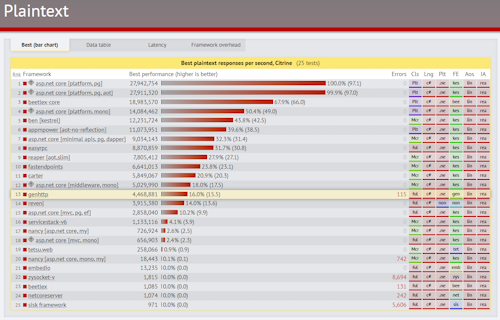
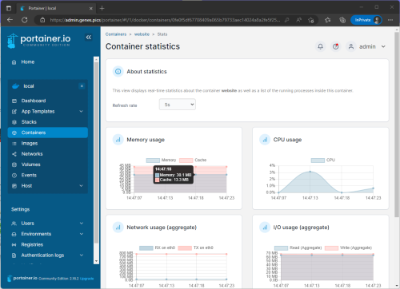
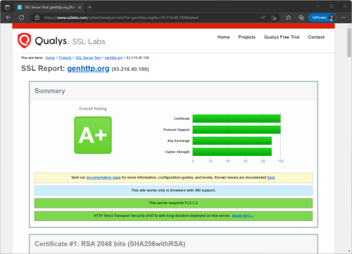

+++
title = 'Features'
description = 'Features of the GenHTTP application framework such as performance, SEO or security.'
date = 2024-06-20T14:10:41+02:00
+++

## Frameworks

GenHTTP provides several frameworks to develop and host web services (e.g. service classes, controller-style or functional-style).
Additionally you can easily host static websites or a single page app. Besides this, the framework
comes with a rich set of features:

- Automatically generated Open API specifications
- Various authentication methods (e.g. API key, JWT, Client Certificates or Basic Auth)
- Support for Websockets and Server Sent Events (SSE)
- Automatic response compression and request decompression
- Client caching directives and automatic eTag handling
- Range support to fetch byte ranges
- Security relevant features (such as automatic redirection to HTTPS)

## Server Performance

In terms of raw HTTP protocol performance, the GenHTTP webserver is located in the middle segment compared to
other server implementations, serving more than four million requests per second. Improving the performance of the server is
an ongoing task, especially since there is currently a lot of potential to be tapped.

*see [TechEmpower Web Framework Benchmarks](https://www.techempower.com/benchmarks/)*

## Footprint

Applications developed with the GenHTTP SDK are optimized for low disk space and memory requirements. A basic application
will consume about 30 MB of memory and 50 MB of disk space when [running in Docker](/documentation/hosting/).

## Security

The GenHTTP webserver uses the default security mechanisms that ship with .NET. This results in
a good security grade of A+ as reported by SSL Labs.

*see [SSL Labs Server Test](https://www.ssllabs.com/ssltest/analyze.html?d=genhttp.org&latest)*
