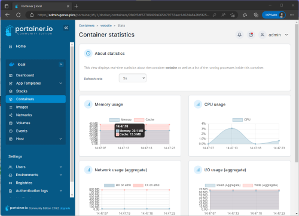
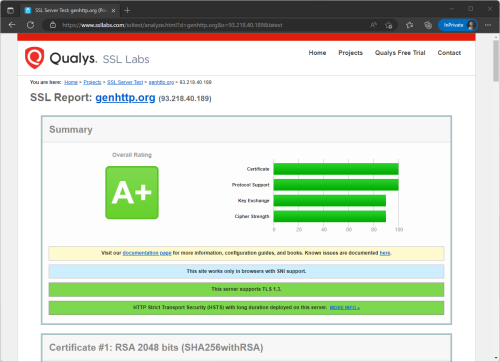

+++
title = 'Features'
description = 'Features of the GenHTTP application framework such as performance, SEO or security.'
date = 2026-09-01T09:35:41+02:00
+++

## Frameworks

GenHTTP provides several frameworks to develop and host web services (e.g. service classes, controller-style or functional-style).
Additionally, you can easily host static websites or a single page app. Besides this, the framework
comes with a rich set of features:

- Automatically generated Open API specifications
- Various authentication methods (e.g. API key, JWT, Client Certificates or Basic Auth)
- Support for Websockets and Server Sent Events (SSE)
- Automatic response compression and request decompression
- Client caching directives and automatic eTag handling
- Range support to fetch byte ranges
- Security relevant features (such as automatic redirection to HTTPS)

## Server Performance

According to [HTTP Arena](https://www.http-arena.com), GenHTTP is currently the fastest web server for HTTP/1.1. The following
excerpt shows how GenHTTP compares to other C# servers in the field:

| Framework         | Score (Composite H1) |
|-------------------|----------------------|
| `genhttp-ioxide`  | 6211                 |
| `genhttp`         | 4088                 |
| `simplew`         | 3671                 |
| `genhttp-kestrel` | 2992                 |
| `carter`          | 2978                 |
| `aspnet-minimal`  | 2715                 |
| `fastendpoints`   | 2660                 |
| `sisk`            | 2047                 |
| `servicestack`    | 237                  |

According to those numbers, stock GenHTTP is 1.5 times faster then ASP.NET Core Minimal API
in a mixed challenge with different use cases and usage scenarios.

## Footprint

Applications developed with the GenHTTP SDK are optimized for low disk space and memory requirements. A basic application
will consume about 30 MB of memory and 50 MB of disk space when [running in Docker](/documentation/hosting/).

## Security

The GenHTTP webserver uses the default security mechanisms that ship with .NET. This results in
a good security grade of A+ as reported by SSL Labs.

*see [SSL Labs Server Test](https://www.ssllabs.com/ssltest/analyze.html?d=genhttp.org&latest)*
