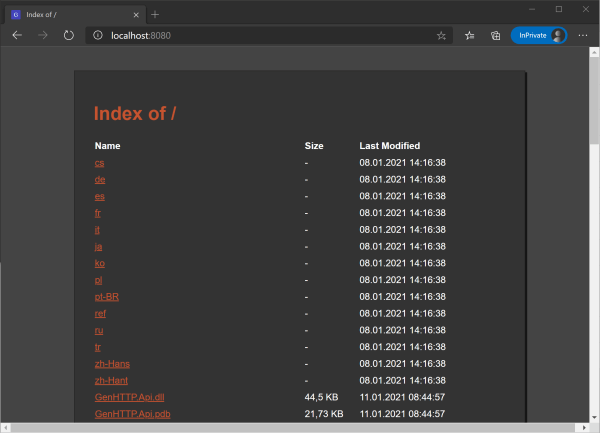

---
title: Directory Browsing
cascade:
  type: docs
---

The directory listing provider serves a simple web UI allowing users to browse directories
and files read from a [resource tree](../concepts/resources.md) below the specified path.

```csharp
var tree = ResourceTree.FromDirectory("/var/www/documents/");

Host.Create()
    .Handler(DirectoryListing.From(tree))
    .Run();
```

In this example, the listing view will be available at http://localhost:8080/.
The generated view will be rendered using the template of the [Website](./websites) 
the provider is embedded into (or the server theme by default).


