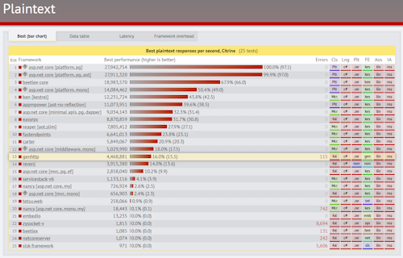

## Server Performance

In terms of raw HTTP protocol performance, the GenHTTP webserver is located in the middle segment compared to
other server implementations, serving more than four million requests per second. Improving the performance of the server is
an ongoing task, especially since there is currently a lot of potential to be tapped.

*see [TechEmpower Web Framework Benchmarks](https://www.techempower.com/benchmarks/)*

## Footprint

Applications developed with the GenHTTP SDK are optimized for low disk space and memory requirements. A basic application
will consume about 30 MB of memory and 50 MB of disk space when [running in Docker](/documentation/hosting/).

## Security

The GenHTTP webserver uses the default security mechanisms that ship with .NET. This results in
a good security grade of A+ as reported by SSL Labs.

*see [SSL Labs Server Test](https://www.ssllabs.com/ssltest/analyze.html?d=genhttp.org&latest)*